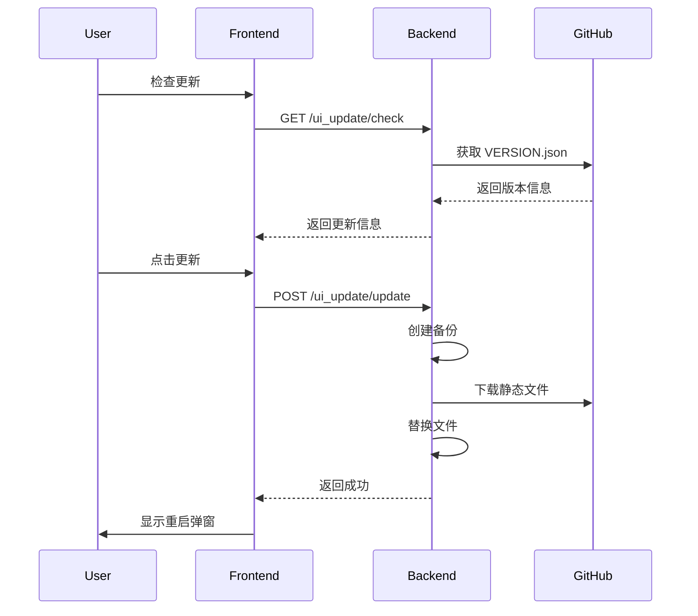
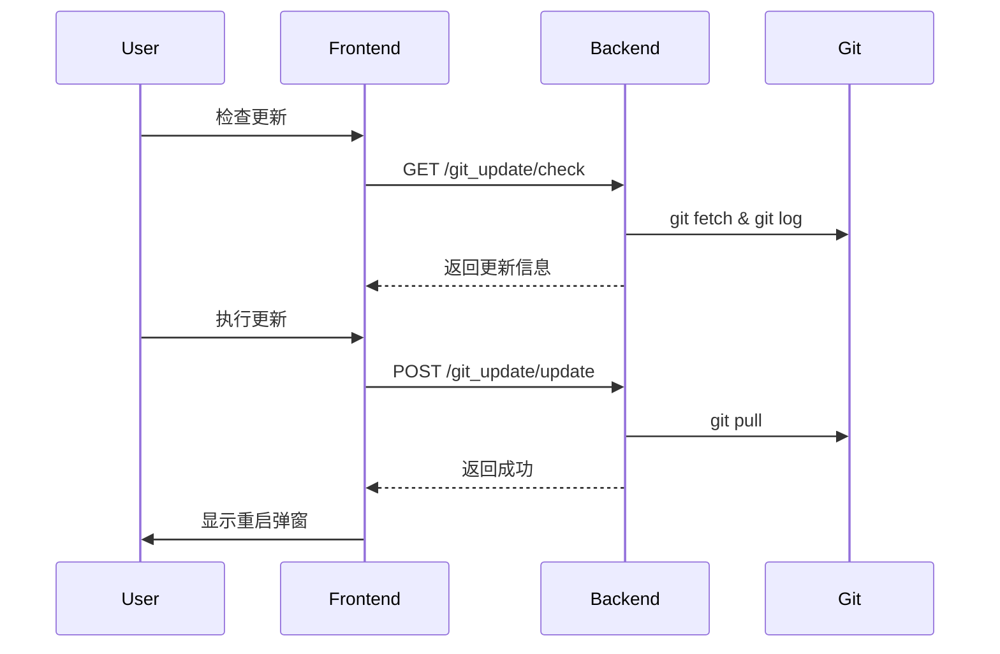

# MoFox WebUI 自动更新系统设计文档

## 📋 概述

本文档描述 MoFox WebUI 的自动更新系统设计方案：
1. **UI 静态文件自动更新** - 通过独立分支管理编译后的静态文件
2. **主程序更新** - Git 拉取更新主程序代码
3. **Git 环境设置** - 配置 Git 路径和环境
4. **重启提示弹窗** - 更新完成后提示用户重启
5. **三标签页设计** - UI更新、主程序更新、Git设置分离展示

---

## 🏗️ 架构设计

### 整体架构

```
GitHub Repository
├── main 分支 (源代码)
│   ├── forward/mofox-webui/src/
│   ├── backend/
│   └── .github/workflows/
│
└── webui-dist 分支 (静态文件) ← GitHub Actions 自动构建推送
    ├── index.html
    ├── assets/
    └── VERSION.json
```

### 分支策略

| 分支 | 用途 | 更新方式 |
|------|------|----------|
| `main` | 源代码 | 开发者提交 |
| `webui-dist` | 编译后静态文件 | GitHub Actions 自动推送 |

---

## 📦 版本信息文件

### VERSION.json

```json
{
  "version": "2026.0101.1200",
  "build_time": "2026-01-01T12:00:00Z",
  "commit": "abc1234567890def",
  "branch": "main",
  "files": [
    { "path": "index.html", "hash": "sha256:abc123...", "size": 1234 }
  ],
  "changelog": [
    "fix: 修复配置编辑器显示问题",
    "feat: 新增表情包管理功能"
  ]
}
```

---

## 🔧 GitHub Actions 工作流

### build-webui.yml

只推送到 `webui-dist` 分支，不创建 Release。Commit 消息包含最近提交作为 changelog。

```yaml
name: Build WebUI

on:
  schedule:
    - cron: '0 0 * * *'
  workflow_dispatch:
  push:
    paths:
      - '.github/workflows/build-webui.yml'
      - 'forward/mofox-webui/**'

jobs:
  build-and-deploy:
    runs-on: ubuntu-latest
    permissions:
      contents: write
    
    steps:
      - name: Checkout repository
        uses: actions/checkout@v4
        with:
          fetch-depth: 50

      - name: Check for new commits
        id: check_commits
        run: |
          git fetch origin webui-dist:webui-dist 2>/dev/null || true
          
          if git rev-parse webui-dist >/dev/null 2>&1; then
            LAST_BUILD_COMMIT=$(git log webui-dist -1 --format="%s" | grep -oP 'Source: \K[a-f0-9]+' || echo "")
            if [ -n "$LAST_BUILD_COMMIT" ]; then
              COMMITS_SINCE=$(git rev-list ${LAST_BUILD_COMMIT}..HEAD --count 2>/dev/null || echo "999")
              [ "$COMMITS_SINCE" -gt "0" ] && echo "has_new_commits=true" >> $GITHUB_OUTPUT || echo "has_new_commits=false" >> $GITHUB_OUTPUT
            else
              echo "has_new_commits=true" >> $GITHUB_OUTPUT
            fi
          else
            echo "has_new_commits=true" >> $GITHUB_OUTPUT
          fi
          
          [ "${{ github.event_name }}" = "workflow_dispatch" ] && echo "has_new_commits=true" >> $GITHUB_OUTPUT

      - name: Setup Node.js
        if: steps.check_commits.outputs.has_new_commits == 'true'
        uses: actions/setup-node@v4
        with:
          node-version: '20'
          cache: 'npm'
          cache-dependency-path: forward/mofox-webui/package-lock.json

      - name: Build frontend
        if: steps.check_commits.outputs.has_new_commits == 'true'
        run: |
          cd forward/mofox-webui
          npm ci
          npm run build

      - name: Generate version info
        if: steps.check_commits.outputs.has_new_commits == 'true'
        run: |
          VERSION="$(date -u '+%Y.%m%d.%H%M')"
          CHANGELOG=$(git log --oneline --no-merges -10 --format="%s" | jq -R -s -c 'split("\n") | map(select(length > 0))')
          
          cd forward/mofox-webui/dist
          FILES_JSON=$(find . -type f ! -name 'VERSION.json' | while read file; do
            echo "{\"path\": \"$(echo $file | sed 's|^\./||')\", \"hash\": \"$(sha256sum $file | cut -d' ' -f1)\", \"size\": $(stat -c%s $file)}"
          done | jq -s .)
          
          cat > VERSION.json << EOF
          {
            "version": "$VERSION",
            "build_time": "$(date -u '+%Y-%m-%dT%H:%M:%SZ')",
            "commit": "${{ github.sha }}",
            "branch": "${{ github.ref_name }}",
            "files": $FILES_JSON,
            "changelog": $CHANGELOG
          }
          EOF
          
          git log --oneline --no-merges -5 --format="- %s" > /tmp/changelog.txt

      - name: Deploy to webui-dist branch
        if: steps.check_commits.outputs.has_new_commits == 'true'
        run: |
          cd forward/mofox-webui/dist
          git config --global user.name "github-actions[bot]"
          git config --global user.email "github-actions[bot]@users.noreply.github.com"
          git init && git checkout -b webui-dist && git add -A
          
          git commit -m "Build: v$(date -u '+%Y.%m%d.%H%M')

          Source: ${{ github.sha }}
          Branch: ${{ github.ref_name }}

          Recent changes:
          $(cat /tmp/changelog.txt)"
          
          git remote add origin https://x-access-token:${{ secrets.GITHUB_TOKEN }}@github.com/${{ github.repository }}.git
          git push -f origin webui-dist
```

---

## 🐍 后端实现

### 文件结构

```
backend/
├── routers/
│   ├── git_update_router.py    # 主程序更新路由（重构，只保留更新逻辑）
│   ├── git_env_router.py       # Git 环境管理路由（新增，拆分出来）
│   └── ui_update_router.py     # UI 更新路由（新增）
└── utils/
    └── update/                  # 更新工具模块（新增）
        ├── __init__.py
        ├── models.py            # Pydantic 数据模型
        ├── git_detector.py      # Git 环境检测
        ├── git_installer.py     # Git 安装器
        ├── git_updater.py       # Git 更新器
        ├── venv_utils.py        # 虚拟环境工具
        └── ui_version_manager.py # UI 版本管理器
```

### 模块职责

#### utils/update/models.py

集中管理所有数据模型：

| 模型 | 用途 |
|------|------|
| `GitStatusResponse` | Git 状态响应 |
| `GitCheckUpdateResponse` | 检查更新响应 |
| `GitUpdateResponse` | 更新响应 |
| `UIVersionInfo` | UI 版本信息 |
| `UIUpdateCheckResponse` | UI 更新检查响应 |
| `UIUpdateResponse` | UI 更新响应 |
| `UIBackupInfo` | UI 备份信息 |

#### utils/update/git_detector.py

Git 环境检测：

| 方法 | 功能 |
|------|------|
| `is_git_available()` | 检查 Git 是否可用 |
| `is_git_repo(path)` | 检查是否为 Git 仓库 |
| `get_git_version()` | 获取 Git 版本 |
| `get_git_executable()` | 获取 Git 路径 |
| `find_portable_git()` | 查找便携版 Git |

#### utils/update/git_installer.py

Git 自动安装（全平台）：

| 方法 | 功能 |
|------|------|
| `install_git()` | 自动安装 Git（入口） |
| `_install_windows()` | Windows 便携版安装 |
| `_install_linux()` | Linux 包管理器安装 |
| `_install_macos()` | macOS Homebrew 安装 |

#### utils/update/git_updater.py

Git 更新管理：

| 方法 | 功能 |
|------|------|
| `check_updates()` | 检查是否有更新 |
| `pull_updates()` | 拉取更新 |
| `rollback()` | 回滚版本 |
| `get_branches()` | 获取分支列表 |
| `switch_branch()` | 切换分支 |

#### utils/update/venv_utils.py

虚拟环境和依赖管理：

| 类/方法 | 功能 |
|---------|------|
| `VenvDetector.detect_venv_type()` | 检测虚拟环境类型 |
| `DependencyInstaller.install()` | 安装依赖 |

#### utils/update/ui_version_manager.py

UI 版本管理（新增）：

| 方法 | 功能 |
|------|------|
| `get_current_version()` | 获取本地 UI 版本 |
| `fetch_remote_version()` | 获取远程最新版本 |
| `check_update()` | 检查是否有更新 |
| `create_backup()` | 备份当前静态文件 |
| `download_and_apply()` | 下载并应用更新 |
| `list_backups()` | 列出备份 |
| `rollback()` | 回滚到指定备份 |

**默认配置（硬编码）**：

```python
# ui_version_manager.py
GITHUB_OWNER = "your-org"
GITHUB_REPO = "MoFox-Core-Webui"
GITHUB_BRANCH = "webui-dist"
GITHUB_RAW_URL = f"https://raw.githubusercontent.com/{GITHUB_OWNER}/{GITHUB_REPO}/{GITHUB_BRANCH}"
MIRROR_URL = "https://ghproxy.com/"  # 可选镜像
AUTO_CHECK = True
CHECK_INTERVAL = 60  # 分钟
MAX_BACKUPS = 5
```

### 路由组件

#### routers/ui_update_router.py（新增）

| 端点 | 方法 | 功能 |
|------|------|------|
| `/ui_update/version` | GET | 获取当前 UI 版本 |
| `/ui_update/check` | GET | 检查 UI 更新 |
| `/ui_update/update` | POST | 执行 UI 更新 |
| `/ui_update/backups` | GET | 获取备份列表 |
| `/ui_update/rollback` | POST | 回滚 UI 版本 |

#### routers/git_env_router.py（新增，从 git_update_router 拆分）

Git 环境管理，独立于更新逻辑：

| 端点 | 方法 | 功能 |
|------|------|------|
| `/git_env/status` | GET | 获取 Git 环境状态 |
| `/git_env/install` | POST | 安装 Git（Windows 便携版） |
| `/git_env/set-path` | POST | 设置自定义 Git 路径 |
| `/git_env/clear-path` | DELETE | 清除自定义路径 |

#### routers/git_update_router.py（重构，只保留更新逻辑）

主程序 Git 更新，引用 `utils/update/` 中的模块：

| 端点 | 方法 | 功能 |
|------|------|------|
| `/git_update/check` | GET | 检查主程序更新 |
| `/git_update/update` | POST | 执行主程序更新 |
| `/git_update/rollback` | POST | 回滚版本 |
| `/git_update/branches` | GET | 获取分支列表 |
| `/git_update/switch-branch` | POST | 切换分支 |

---

## 🎨 前端实现

### 文件结构

```
src/
├── api/
│   ├── git_update.ts          # 已有
│   └── ui_update.ts           # 新增
├── components/
│   ├── RestartDialog.vue      # 新增
│   └── update/
│       ├── UIUpdateTab.vue    # 新增
│       ├── MainUpdateTab.vue  # 新增
│       └── GitSettingsTab.vue # 新增
├── composables/
│   └── useAutoUpdate.ts       # 新增
└── views/
    └── UpdateView.vue         # 新增
```

### 页面结构：三标签页

```
┌─────────────────────────────────────────────────────────────────┐
│  更新管理                                              [刷新]   │
├─────────────────────────────────────────────────────────────────┤
│  ┌──────────────┐ ┌──────────────┐ ┌──────────────┐            │
│  │  🌐 UI更新   │ │ 🤖 主程序    │ │  ⚙️ Git设置  │            │
│  └──────────────┘ └──────────────┘ └──────────────┘            │
├─────────────────────────────────────────────────────────────────┤
│                     [标签页内容区域]                             │
└─────────────────────────────────────────────────────────────────┘
```

### 组件设计

#### 1. UpdateView.vue - 主容器

| 属性 | 说明 |
|------|------|
| 路由 | `/dashboard/update` |
| 功能 | 管理标签页切换、触发 RestartDialog |

**标签页配置**：

| ID | 标签 | 图标 | 组件 |
|----|------|------|------|
| `ui` | UI更新 | `web` | `UIUpdateTab` |
| `main` | 主程序 | `smart_toy` | `MainUpdateTab` |
| `git` | Git设置 | `settings` | `GitSettingsTab` |

#### 2. UIUpdateTab.vue

```
┌─────────────────────────────────────────────────────┐
│ 🌐 当前版本                                         │
│ ┌─────────────────────────────────────────────────┐ │
│ │ 版本: v2026.0101.1200 | 构建: 2026-01-01 12:00 │ │
│ │ 分支: main | Commit: abc1234                   │ │
│ └─────────────────────────────────────────────────┘ │
├─────────────────────────────────────────────────────┤
│ 🔄 检查更新                            [检查更新]  │
│ ┌─────────────────────────────────────────────────┐ │
│ │ ✅ 发现新版本 v2026.0102.1000                   │ │
│ │ 更新内容:                                        │ │
│ │   • fix: 修复xxx                                │ │
│ │   • feat: 新增xxx                               │ │
│ │                                    [立即更新]   │ │
│ └─────────────────────────────────────────────────┘ │
├─────────────────────────────────────────────────────┤
│ 📦 备份管理                                         │
│   backup_v2026.0101.1200.zip         [恢复]        │
└─────────────────────────────────────────────────────┘
```

#### 3. MainUpdateTab.vue

```
┌─────────────────────────────────────────────────────┐
│ 🔀 分支管理                                         │
│   当前分支: [main ▼]                 [切换分支]    │
├─────────────────────────────────────────────────────┤
│ 🔄 更新检测                            [检查更新]  │
│ ┌─────────────────────────────────────────────────┐ │
│ │ 📦 有 5 个新提交                                │ │
│ │   • fix: 修复某问题                              │ │
│ │   • feat: 新增某功能                             │ │
│ │                                    [立即更新]   │ │
│ └─────────────────────────────────────────────────┘ │
└─────────────────────────────────────────────────────┘
```

#### 4. GitSettingsTab.vue

```
┌─────────────────────────────────────────────────────┐
│ ⚙️ Git 环境状态                                     │
│   状态: ✅ 可用  版本: 2.43.0  来源: 系统           │
├─────────────────────────────────────────────────────┤
│ 📂 Git 路径                                         │
│   C:\Program Files\Git\bin\git.exe                 │
│            [设置自定义路径] [清除自定义]            │
├─────────────────────────────────────────────────────┤
│ 📥 安装 Git（仅 Windows 未安装时显示）              │
│   检测到系统未安装 Git     [一键安装 Git]          │
└─────────────────────────────────────────────────────┘
```

#### 5. RestartDialog.vue

| Props | 类型 | 说明 |
|-------|------|------|
| `modelValue` | `boolean` | v-model 控制显示 |
| `updateType` | `'main' \| 'ui' \| 'both'` | 更新类型 |
| `changelog` | `string[]` | 更新日志 |

| Events | 说明 |
|--------|------|
| `restart` | 点击立即重启 |
| `later` | 点击稍后重启 |

#### 6. useAutoUpdate.ts

| 导出 | 类型 | 说明 |
|------|------|------|
| `state` | `Ref<AutoUpdateState>` | 更新状态 |
| `checkForUpdates` | `() => Promise<void>` | 检查更新 |
| `showRestartPrompt` | `(type, changelog) => void` | 显示重启弹窗 |

### API 类型定义

```typescript
// api/ui_update.ts
interface UIVersionInfo {
  version: string
  build_time: string
  commit: string
  branch: string
  changelog: string[]
}

interface UIUpdateCheckResult {
  success: boolean
  has_update: boolean
  current_version?: string
  latest_version?: string
  changelog: string[]
  download_size?: number
}

interface UIBackupInfo {
  name: string
  version?: string
  timestamp: string
}
```

### 路由配置

```typescript
// router/index.ts
{
  path: '/dashboard/update',
  name: 'Update',
  component: () => import('@/views/UpdateView.vue'),
  meta: { title: '更新管理' }
}
```

### 侧边栏更新

| 原配置 | 新配置 |
|--------|--------|
| 名称: Git更新 | 名称: 更新管理 |
| 图标: git_update | 图标: system_update |
| 路由: /dashboard/git-update | 路由: /dashboard/update |

---

## 🔄 更新流程

### UI 更新流程



### 主程序更新流程



---

## 🚀 部署步骤

### 1. 创建 webui-dist 分支

```bash
git checkout --orphan webui-dist
git rm -rf .
echo "WebUI Distribution Branch" > README.md
git add README.md
git commit -m "Initial commit"
git push origin webui-dist
```

### 2. 添加 GitHub Actions 工作流

创建 `.github/workflows/build-webui.yml`

### 3. 添加后端模块

```
backend/utils/update/     ← 新增工具模块
backend/routers/ui_update_router.py  ← 新增路由
backend/routers/git_env_router.py    ← 新增路由（从 git_update_router 拆分）
```

在 `routers/__init__.py` 中导出：

```python
from .ui_update_router import UIUpdateRouterComponent
from .git_env_router import GitEnvRouterComponent
```

在 `plugin.py` 的 `get_plugin_components()` 中注册：

```python
from .routers import (
    # ... 现有导入
    GitUpdateRouterComponent,
    GitEnvRouterComponent,      # 新增
    UIUpdateRouterComponent,    # 新增
)

def get_plugin_components(self) -> List:
    return [
        # ... 现有组件
        (GitUpdateRouterComponent.get_router_info(), GitUpdateRouterComponent),
        (GitEnvRouterComponent.get_router_info(), GitEnvRouterComponent),        # 新增
        (UIUpdateRouterComponent.get_router_info(), UIUpdateRouterComponent),    # 新增
    ]
```

### 4. 添加前端组件

```
src/api/ui_update.ts
src/views/UpdateView.vue
src/components/update/*.vue
src/components/RestartDialog.vue
src/composables/useAutoUpdate.ts
```

### 5. 更新路由和导航

---

## 📝 注意事项

1. **网络问题**：添加镜像支持（ghproxy）
2. **备份机制**：更新前自动备份，保留最近 5 个
3. **原子更新**：临时目录下载，完成后替换
4. **错误恢复**：失败时自动回滚
5. **用户体验**：显示进度，完成后友好提示

---

## 🔮 未来扩展

1. 增量更新（只下载变更文件）
2. 后台预下载
3. 灰度发布
4. 自定义更新源
